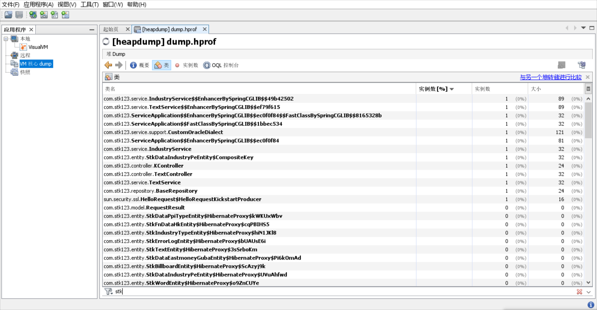

https://arthas.aliyun.com/doc/en/quick-start.html
https://arthas.aliyun.com/doc/en/advanced-use.html

#### Print usage:
> java -jar arthas-boot.jar -h

#### Attach one java process
> java -jar arthas-boot.jar 15844

```
[INFO] arthas-boot version: 3.4.4
[INFO] Process 15844 already using port 3658
[INFO] Process 15844 already using port 8563
[INFO] arthas home: D:\IdeaProjects\stk123\common\arthas-packaging-3.4.4
[INFO] The target process already listen port 3658, skip attach.
[INFO] arthas-client connect 127.0.0.1 3658
  ,---.  ,------. ,--------.,--.  ,--.  ,---.   ,---.
 /  O  \ |  .--. ''--.  .--'|  '--'  | /  O  \ '   .-'
|  .-.  ||  '--'.'   |  |   |  .--.  ||  .-.  |`.  `-.
|  | |  ||  |\  \    |  |   |  |  |  ||  | |  |.-'    |
`--' `--'`--' '--'   `--'   `--'  `--'`--' `--'`-----'


wiki      https://arthas.aliyun.com/doc
tutorials https://arthas.aliyun.com/doc/arthas-tutorials.html
version   3.4.4
pid       15844
time      2020-12-01 16:31:49
[arthas@15844]$
```

#### Decompile Class (which has been loaded into JVM) with jad command
> jad com.stk123.ServiceApplication

#### Use ‘watch’ to view the return object of demo.MathGame#primeFactors
https://arthas.aliyun.com/doc/en/watch.html

#### heapdump
> [arthas@15844]$ heapdump dump.hprof

you can open dump.hprof with jvisualvm.exe :


